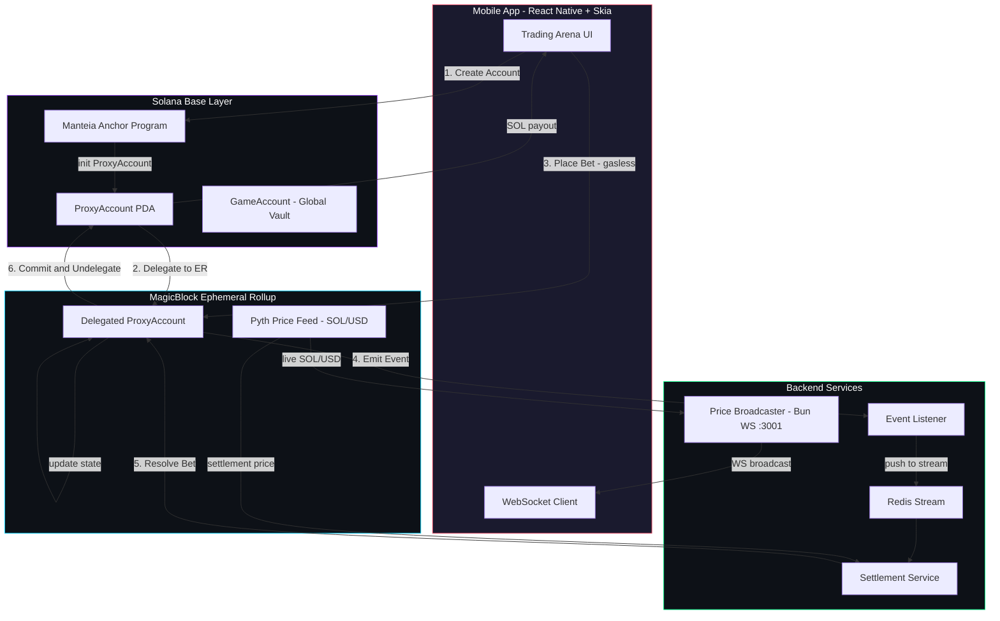
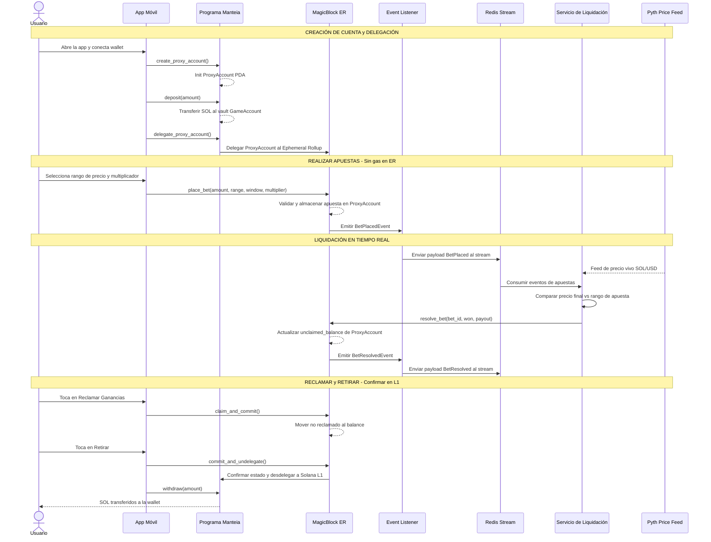

# Manteia — Arena de Predicciones de Solana en Tiempo Real

[](https://solana.com)
[](https://magicblock.gg)
[](https://www.anchor-lang.com/)
[](https://expo.dev)
[](https://bun.sh)

> **Manteia** *(Adivinación en griego)* — Un mercado de predicciones gamificado y ultra rápido en Solana donde los usuarios apuestan a rangos de precios de SOL/USD en ventanas de tiempo extremadamente cortas. Impulsado por **MagicBlock Ephemeral Rollups** para una ejecución sin gas y en submilisegundos, con liquidaciones en tiempo real basadas en feeds de precios vivos de Pyth.

---

## ✨ Aspectos Destacados

| Característica | Detalle |
|---|---|
| **⚡ Predicciones de 10 Segundos** | Elige un rango de precio SOL/USD, selecciona un multiplicador y observa la resolución en tiempo real |
| **🏎️ Finalidad en Sub-ms** | El estado se delega a MagicBlock Ephemeral Rollups — cero gas, confirmación instantánea |
| **📡 Liquidación en Vivo** | Un servicio de liquidación consume eventos on-chain + precios reales de Pyth para resolver apuestas automáticamente |
| **🔐 Asegurado por Solana** | El estado final se confirma en la L1 de Solana al retirar — seguridad total de la capa base |
| **🎮 Arena Gamificada** | Batallas multijugador, tablas de clasificación y una arena de práctica — se siente como un juego, no como un DEX |
| **📱 Enfoque Mobile-First** | React Native + Skia para gráficos fluidos y trading a una sola mano en iOS y Android |

---

## 🏗️ Descripción General de la Arquitectura

Manteia utiliza un ciclo de vida de **delegar → ejecutar → liquidar → confirmar** impulsado por MagicBlock Ephemeral Rollups. El PDA on-chain del usuario (`ProxyAccount`) se delega a un rollup efímero para interacciones de alta velocidad y sin gas, y se confirma nuevamente en la capa base de Solana al momento del retiro.



---

## 🔄 Ciclo de Vida: Apuesta → Liquidación → Retiro

El recorrido completo del usuario desde la creación de la cuenta hasta el retiro de SOL:



---

## ⛓️ Análisis Profundo del Smart Contract

El programa de Anchor de Manteia ([`HCvWBZpYDeiTMUaSmCRm5jP67M6wYV2NDBjAG4qdDLNE`](https://explorer.solana.com/address/HCvWBZpYDeiTMUaSmCRm5jP67M6wYV2NDBjAG4qdDLNE)) está optimizado para una ejecución de alto volumen y baja latencia en MagicBlock Ephemeral Rollups.

### Estado On-Chain

| Cuenta | Propósito | Campos Clave |
|---|---|---|
| **`ProxyAccount`** | PDA por usuario que contiene el balance y hasta **10 apuestas activas** | `owner`, `balance`, `unclaimed_balance`, `bets[10]`, `active_bet_count` |
| **`GameAccount`** | Vault global que gestiona la liquidez de SOL agrupada | `authority`, `total_deposits`, `bump` |
| **`Bet`** | Estructura de apuesta individual (74 bytes cada una) | `target_price_range_start/end`, `prediction_start/end_time`, `payout_multiplier`, `won`, `resolved` |

### Conjunto de Instrucciones

| Instrucción | Descripción |
|---|---|
| `create_proxy_account` | Inicializa el PDA ProxyAccount de un usuario |
| `initialize_game_account` | Configura el vault global del juego |
| `delegate_proxy_account` | Delega el ProxyAccount al MagicBlock Ephemeral Rollup |
| `deposit` | Transfiere SOL al vault GameAccount y acredita el balance del usuario |
| `place_bet` | Realiza una apuesta de predicción de precio con rango, ventana de tiempo y multiplicador |
| `resolve_bet` | Liquida una apuesta como ganada/perdida con el pago calculado |
| `claim_and_commit` | Reclama ganancias y confirma el estado en el rollup |
| `commit_and_undelegate` | Confirma el estado final en Solana L1 y desdelega |
| `withdraw` | Retira SOL del vault hacia la wallet del usuario |

### Eventos Emitidos

- **`BetPlacedEvent`** — usuario, bet_id, monto, rango de precio, ventana de tiempo, multiplicador
- **`BetResolvedEvent`** — usuario, bet_id, ganado, monto_apuesto, monto_pagado
- **`DepositEvent`** / **`WithdrawEvent`** — usuario, monto, nuevo_balance

---

## 🛠️ Stack Tecnológico

### Infraestructura On-Chain
| Tecnología | Rol |
|---|---|
| **Solana** | Capa base para la liquidación del estado final y custodia de SOL |
| **Anchor** | Framework de programas de Solana para smart contracts con seguridad de tipos |
| **MagicBlock Ephemeral Rollups** | Ejecución de transacciones sin gas y en submilisegundos mediante delegación de estado |
| **Pyth Network** | Feeds de precios oráculo SOL/USD en tiempo real |

### Servicios de Backend
| Tecnología | Rol |
|---|---|
| **Bun** | Runtime de alto rendimiento para el servidor de precios WebSocket (`:3001`) |
| **Redis + ioredis** | Pipeline de streaming de eventos (`xadd` / `xreadgroup`) para el ciclo de vida de la apuesta |
| **@solana/web3.js** | Escucha de eventos on-chain para el análisis de logs del programa |

### Frontend Móvil
| Tecnología | Rol |
|---|---|
| **React Native / Expo** | Framework móvil multiplataforma |
| **React Native Skia** | Gráficos, animaciones y efectos visuales acelerados por GPU |
| **Zustand** | Gestión de estado reactiva ligera |

---

## 📂 Estructura del Proyecto

```
manteia/
├── manteia-contract/       # Programa de Solana Anchor
│   └── programs/
│       └── manteia-contract/src/
│           ├── lib.rs                  # Punto de entrada del programa y enrutamiento de instrucciones
│           ├── state.rs                # Estructuras ProxyAccount, GameAccount, Bet
│           ├── events.rs               # Definiciones de eventos on-chain
│           ├── errors.rs               # Códigos de error personalizados
│           └── instructions/
│               ├── create_proxy_account.rs
│               ├── initialize_game_account.rs
│               ├── deposit.rs
│               ├── place_bet.rs
│               ├── resolve_bet.rs
│               ├── claim.rs
│               └── withdraw.rs
├── backend/                # Servidor WebSocket de Bun — transmite precios vivos de SOL/USD
├── price-poller/           # Analizador y depurador de feeds de precios crudos de Pyth
├── event-listener/         # Puente de eventos on-chain → stream de Redis
└── skia/                   # App de React Native Expo con renderizado de Skia
    ├── app/                # Pantallas de Expo Router
    ├── components/         # Componentes de UI reutilizables
    ├── state/              # Stores de Zustand
    ├── server/             # Capa de cliente API
    ├── utils/              # Helpers (Solana, formateo, etc.)
    └── types/              # Definiciones de tipos de TypeScript
```

---

## ⚙️ Primeros Pasos

### Prerrequisitos

- [Anchor CLI](https://www.anchor-lang.com/docs/installation) (v0.30+)
- [Bun](https://bun.sh) (v1.0+)
- [Expo CLI](https://docs.expo.dev/get-started/installation/)
- Servidor Redis ejecutándose localmente
- Solana CLI configurado con una wallet de devnet/localnet

### 1. Construir el Smart Contract

```bash
cd manteia-contract
anchor build
anchor deploy          # Desplegar en localnet o devnet
```

### 2. Iniciar Servicios de Backend

```bash
# Terminal 1 — Transmisor de precios
cd backend
bun install && bun run index.ts

# Terminal 2 — Escucha de eventos
cd event-listener
bun install && bun run index.ts
```

### 3. Lanzar la App Móvil

```bash
cd skia
npm install
npx expo start
```

> **Tip**: Usa Expo Go en tu teléfono o un emulador de iOS/Android para previsualizar la app.

---

## 🎨 Filosofía de Diseño

Manteia está diseñada para sentirse como un **videojuego móvil premium**, no como un tablero financiero:

- **🎨 Excelencia Visual** — Degradados vibrantes, glassmorphism y gráficos renderizados con Skia a altos FPS
- **⚡ Velocidad** — Las interacciones se sienten como gestos, no como transacciones de blockchain
- **👆 Flujo a una sola mano** — Todas las acciones críticas de trading están al alcance del pulgar
- **🏆 Arena Competitiva** — Tablas de clasificación en tiempo real y batallas de predicción multijugador

---
